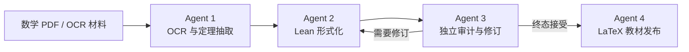

# Agent Formalizer

Agent Formalizer 是一个面向数学教材工程的多 Agent 形式化流水线。它把 PDF 或 OCR 后的数学材料逐步转化为：

1. 可追踪的定理与证明记录；
2. 可由 Lean 4 + Mathlib 检查的形式化证明；
3. 独立复核后的接受或返工结论；
4. 带来源、Lean 文件与哈希绑定的 LaTeX 教材。

项目面向具备大学数学或软件工程基础、但不要求已有 Lean 经验的协作者。核心原则是：

> 数学直觉 → 明确规格 → Agent 输入输出 → Lean 验证

## 流水线



### Agent 1：OCR 与定理抽取

- 使用 Gemini 将 PDF 转为带页码锚点的 Markdown；
- 使用独立的 GPT-5.5 适配器抽取定理陈述、原文证明、证明缺失状态和上下文；
- 对引用文本进行来源锚定，避免静默补写原文；
- 入口与数据契约见 [`code/agents/extraction/README.md`](code/agents/extraction/README.md)。

### Agent 2：Lean 形式化

- 严格读取并校验 Agent 1 的不可变输入包；
- 准备 Aristotle 项目，提交和恢复证明生成任务；
- 对返回源码执行受保护文件、占位符、声明和本地 Lean 构建检查；
- 使用紧凑、哈希绑定的输出布局，并向 Agent 3 交接；
- 入口与命令见 [`code/agents/formalization/README.md`](code/agents/formalization/README.md)。

### Agent 3：独立审计与修订

- 在接触原始数学材料前，只根据 Lean 源码生成盲反译；
- 独立执行 Lean 构建、占位符检查、额外公理检查与 `#print axioms` 审计；
- 比较形式化陈述、原文陈述和证明方法；
- 对不合格候选发出结构化修订请求，并通过 Agent 2 重新验证；
- 支持按章节运行至终态；
- 入口与判定规则见 [`code/agents/review/README.md`](code/agents/review/README.md)。

### Agent 4：LaTeX 教材发布

- 只消费 Agent 3 已终态接受的章节记录；
- 重新检查各阶段的哈希与来源链；
- 生成基于 ElegantBook 的英文 LaTeX 项目；
- 将自然语言材料、审核结论与对应 Lean 源码打包；
- 入口与输出结构见 [`code/agents/publication/README.md`](code/agents/publication/README.md)。

完整设计见 [`docs/architecture/Four-Agent Pipeline.md`](docs/architecture/Four-Agent%20Pipeline.md)。

## 当前进度

- Agent 1 已实现 PDF-to-Markdown 与 Markdown-to-theorem 两阶段分离、分页锚定、来源核验与可恢复抽取。
- Agent 2 已实现输入校验、Aristotle 准备与生成、紧凑输出布局、本地 Lean 验证及失败恢复。
- Agent 3 已实现独立机械审计、盲反译、语义比较、结构化返工和章节级终态汇总。
- Agent 4 已实现接受记录的哈希门控、Lean 源码打包与 ElegantBook LaTeX 生成。
- 项目研究记忆采用 Obsidian-first vault，入口为 [`wiki/index.md`](wiki/index.md)，近期轨迹记录在 [`wiki/process-log.md`](wiki/process-log.md)。

公开仓库同步可复用的源码、规格和文档。私有教材、API 凭据、测试运行结果、生成报告与 slides 不在发布范围内。

## 仓库结构

```text
code/agents/
  extraction/      Agent 1
  formalization/   Agent 2
  review/          Agent 3
  publication/     Agent 4
docs/architecture/ 流水线设计
notes/             工作研究笔记
wiki/              稳定知识与过程索引
raw/               本地来源材料
outputs/           本地生成物
figures/           可复用图像
```

`raw/` 与 `outputs/` 可能包含受版权或隐私约束的材料。提交前请检查来源授权，并遵守 [`.gitignore`](.gitignore) 中的默认隔离规则。

## 环境与快速开始

基本要求：

- Python 3.11+
- [`uv`](https://docs.astral.sh/uv/)
- Lean 4.28.0 与 Mathlib v4.28.0（执行形式化与复核时）
- TeX Live、`latexmk` 和 XeLaTeX（生成 PDF 时）

各 Agent 独立管理环境。以 Agent 2 为例：

```powershell
cd code/agents/formalization
uv sync --locked
uv run --locked formalization-agent --help
```

其他入口：

```powershell
uv run --project code/agents/review review-agent --help
uv run --project code/agents/publication publication-agent --help
```

Agent 1 的安装方式及 `GEMINI_API_KEY`、`GPT55_API_KEY` 配置见其目录 README。所有凭据都应通过进程环境传入，不得写入命令行参数、日志或仓库文件。

## 数据完整性与安全边界

- 每个阶段使用不可变尝试目录和 `latest.json` 指针；
- 关键交接以 SHA-256 绑定上游输入与下游产物；
- Lean 接受结论必须经过独立构建、占位符与公理检查；
- 模型生成的语义判定不能覆盖确定性的机械失败；
- 受版权约束的教材 PDF 与生成片段默认保持本地；
- 测试结果、报告、演示文稿和临时文件默认不发布。

## 项目状态

项目仍处于活跃开发阶段。接口、数据契约和目录结构可能继续演进；开始集成前请优先阅读各 Agent 的 README 与架构文档。
